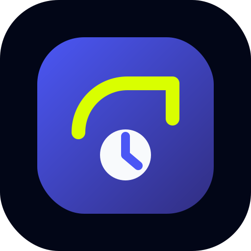

# GlucoTrack

<div align="center">



### Beautiful glucose tracking dashboard built with React, Vite and Supabase.

Track blood sugar readings, visualize trends, and use it like a native mobile app.

</div>

---

## Features

- Beautiful dark-mode UI
- Responsive mobile-first layout
- Interactive glucose charts
- 70–140 mg/dL target range visualization
- Add readings with:
  - date
  - optional time
  - notes
- Supabase backend integration
- PWA support
- iPhone install support
- Fast Vite build setup

---

## Tech Stack

- React
- Vite
- Chart.js
- Supabase
- Nunito Sans
- Vercel

---

## Local Development

```bash
npm install
npm run dev
```

---

## Environment Variables

Create a `.env` file:

```env
VITE_SUPABASE_ANON_KEY=your_supabase_anon_key
```

---

## Build

```bash
npm run build
```

---

## Deploy

Recommended deployment:

- Vercel

Add the environment variable in:

Project Settings → Environment Variables

---

## PWA Assets

Assets are located in:

```text
public/
```

Includes:

- manifest.webmanifest
- icon-192.png
- icon-512.png
- apple-touch-icon.png
- icon.svg

---

## Screenshots

Coming soon.

---

## License

MIT
